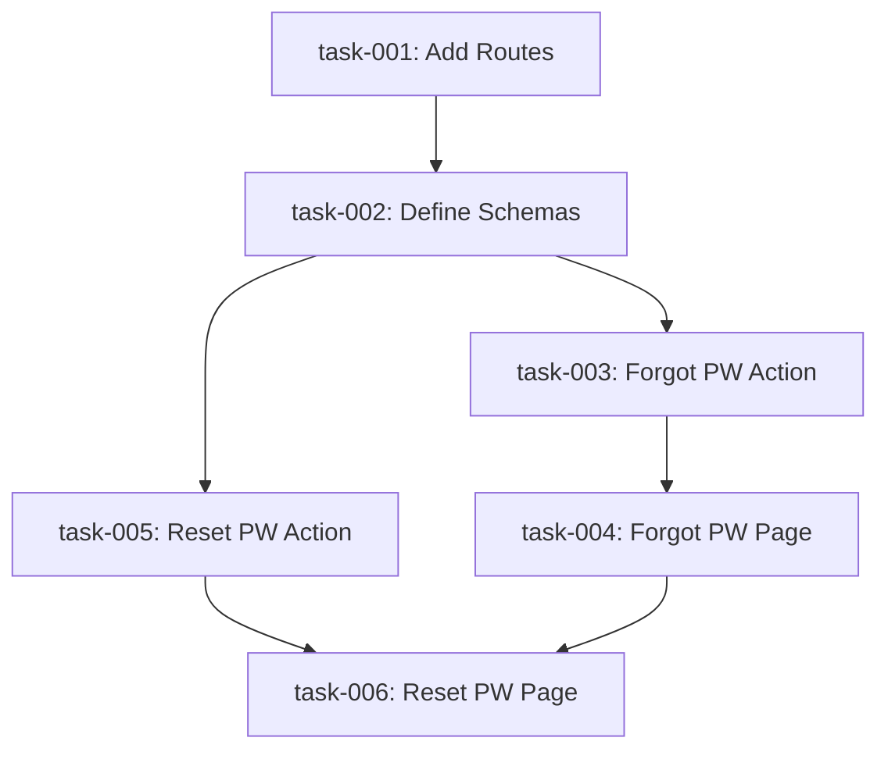

# Implementation Plan: Password Recovery Flow

This plan outlines the implementation of the Forgot Password and Reset Password features for the **summerease** frontend application.

## 1. Goal Statement
Implement a secure and user-friendly password recovery mechanism by integrating the frontend with the `/auth/forgot-password` and `/auth/reset-password` API endpoints.

## 2. Requirements & Constraints
- **Endpoints**: `POST /auth/forgot-password` (needs email), `POST /auth/reset-password` (needs token, new password).
- **Frontend Framework**: Next.js (with App Router and Server Actions).
- **UI Consistency**: Must match existing `AuthLayout` and use components like `Card`, `Button`, `Input`, and `sonner` toasts.
- **Validation**: Use Zod for schema validation on both flow parts.
- **Routing**: `forgot-password` and `reset-password` routes under `(auth)`.

## 3. Decomposed Tasks

| Task ID | Component | Title | Done Condition |
| :--- | :--- | :--- | :--- |
| **task-001** | Core | Add Password Reset Routes | `ROUTES` updated in `app/constants/routes.ts` with `forgotPassword` and `resetPassword` keys. |
| **task-002** | Schema | Define Password Reset Schemas | `forgotPasswordSchema` and `resetPasswordSchema` added to `lib/schemas/auth.schema.ts`. |
| **task-003** | Service | Implement Forgot Password Server Action | `forgotPasswordAction` correctly calls the backend and returns a standardized result. |
| **task-004** | UI | Create Forgot Password Page | `app/(auth)/forgot-password/page.tsx` built with functional email submission. |
| **task-005** | Service | Implement Reset Password Server Action | `resetPasswordAction` correctly handles the token and new password call. |
| **task-006** | UI | Create Reset Password Page | `app/(auth)/reset-password/page.tsx` built with password input and URL token extraction. |

## 4. Enhanced AI Planning Prompt
If you were to hand this task over to an AI agent, here is the structured prompt that would guarantee the best results:

> **Role**: Senior Full-Stack Engineer (Next.js Expert)
> 
> **Objective**: Implement the complete Password Recovery flow in our Next.js frontend, integrating with the following backend endpoints:
> - `POST /auth/forgot-password` (Payload: `{ email: string }`)
> - `POST /auth/reset-password` (Payload: `{ token: string, newPassword: string }`)
>
> **Technical Requirements**:
> 1. **Server Actions**: Create relevant actions in `lib/actions/`. Follow the pattern in `signinAction.ts`.
> 2. **Validation**: Use `Zod` for schema validation. Update `lib/schemas/auth.schema.ts` with schemas for email submission and new password entry (including password strength and matching confirmation).
> 3. **UI Components**: Re-use `AuthLayout`, `Card`, `Field`, `Input`, and `Button`. Match the aesthetic of the existing login page.
> 4. **Route Protection**: The `reset-password` page should extract the token from the URL search params (`?token=...`). Redirect to login upon successful reset.
> 5. **User Experience**: Display feedback using `sonner` toasts for success and `FormError` for API/validation failures.
>
> **Context Reference**:
> - Login page: `app/(auth)/login/page.tsx`
> - Signin action template: `lib/actions/signinAction.ts`
> - Routes: `app/constants/routes.ts`
> - Schemas: `lib/schemas/auth.schema.ts`

## 5. Risk Register
- **Risk 1**: Mismatched password reset token key in URL (e.g., `token` vs `resetToken`). 
    - *Mitigation*: Verify backend naming convention before implementation.
- **Risk 2**: Potential security flaw where `reset-password` link allows multiple uses or expires too quickly.
    - *Mitigation*: Ensure frontend handles expiration errors gracefully by redirecting users back to the 'Forgot Password' request page.
- **Risk 3**: Accessibility (Aria-labels and focus management) on new forms.
    - *Mitigation*: Follow the labeling pattern used in the current `LoginPage`.

## 6. Task Graph

